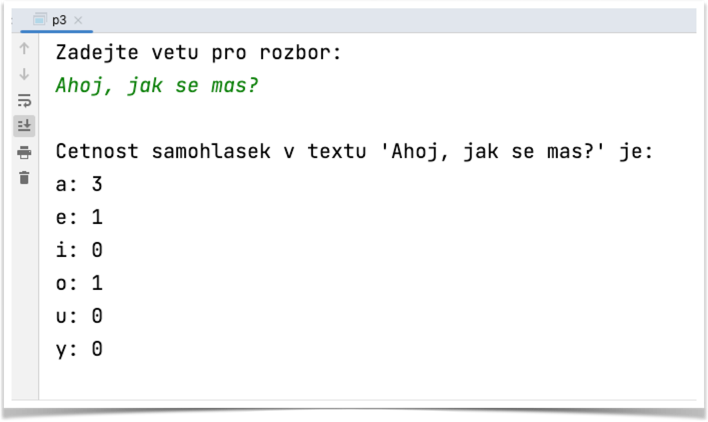

# Příklad 3
## Práce s řetězci, větný rozbor

Napište program, který načte větu z klávesnice a v dané větě spočítá četnost jednotlivých samohlásek (a, e, i, o, u, y).
Program nebude rozlišovat malá a velká písmena.
Tedy **A** se započítá stejně jako **a**. Využijte pomocná pole, která budou namapována pomocí indexů. Tedy znaku v poli na indexu `i` bude odpovídat četnost v druhém poli na indexu `i`:

```
znaky[i] → cetnost[i]
```

